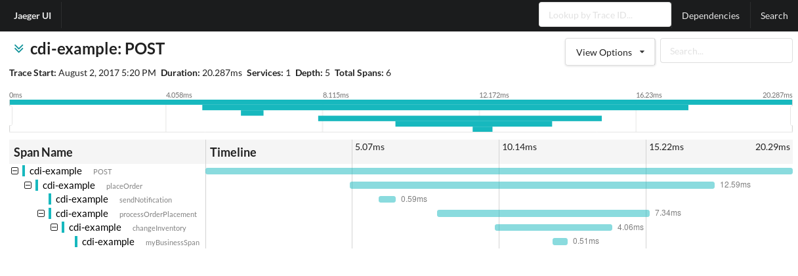

# OpenTracing CDI - Example

## The example

This example shows the different ways to use the OpenTracing CDI integration. It features
getting a `Tracer` injected into your components, as well as a `SpanContext` (when the Servlet
integration is also in place) and a `Scope` (current active span) for non-async applications.

The example has the following call tree:



Refer to each individual example for more information on how it works.

## Running

In order to visualize the spans, you'll need an instance of Jaeger running locally.
Any other OpenTracing tracer is supported: all it requires is to change the `pom.xml`
to remove Jaeger's dependencies and add your `TracerResolver` compatible Tracer.

Jaeger can be run via Docker as follows:
```
docker run \
    --rm \
    -p5775:5775/udp \
    -p6831:6831/udp \
    -p6832:6832/udp \
    -p5778:5778 \
    -p16686:16686 \
    -p14268:14268 \
    --name=jaeger \
    jaegertracing/all-in-one:latest
```

Make sure to at least export the environment variable `JAEGER_SERVICE_NAME`,
otherwise Jaeger will complain. A good set for development and testing purposes
is the following:

```
export JAEGER_SERVICE_NAME=opentracing-cdi-example
export JAEGER_REPORTER_LOG_SPANS=true
export JAEGER_SAMPLER_TYPE=const
export JAEGER_SAMPLER_PARAM=1
```

Once that is done, the example can be run as:
```
mvn wildfly:run
```

After Wildfly starts, traces can be created by making calls like this:
```
curl -v -X POST localhost:8080/opentracing-cdi-example/v1/order
```

If everything works as expected, the following can be seen on the logs:
```
15:12:02,053 INFO  [io.opentracing.contrib.cdi.example.Endpoint] (default task-1) Request received to place an order
15:12:02,053 INFO  [io.opentracing.contrib.cdi.example.AccountService] (default task-1) Notifying the account owner about a new order
15:12:02,054 INFO  [com.uber.jaeger.reporters.LoggingReporter] (default task-1) Span reported: 32fe0f229781cb06:72ae35e1a160506a:a018494612810ee:1 - sendNotification
15:12:02,054 INFO  [io.opentracing.contrib.cdi.example.OrderService] (default task-1) Placing order
15:12:02,056 INFO  [io.opentracing.contrib.cdi.example.InventoryService] (default task-1) Changing the inventory
15:12:02,058 INFO  [io.opentracing.contrib.cdi.example.InventoryNotificationService] (default task-1) Sending an inventory change notification
15:12:02,058 INFO  [com.uber.jaeger.reporters.LoggingReporter] (default task-1) Span reported: 32fe0f229781cb06:1597b01b0bb2ea0a:b5db3e82b498a397:1 - myBusinessSpan
15:12:02,058 INFO  [com.uber.jaeger.reporters.LoggingReporter] (default task-1) Span reported: 32fe0f229781cb06:b5db3e82b498a397:1564d265a555a775:1 - changeInventory
15:12:02,058 INFO  [com.uber.jaeger.reporters.LoggingReporter] (default task-1) Span reported: 32fe0f229781cb06:1564d265a555a775:a018494612810ee:1 - processOrderPlacement
15:12:02,059 INFO  [com.uber.jaeger.reporters.LoggingReporter] (default task-1) Span reported: 32fe0f229781cb06:a018494612810ee:32fe0f229781cb06:1 - placeOrder
15:12:02,071 INFO  [com.uber.jaeger.reporters.LoggingReporter] (default task-1) Span reported: 32fe0f229781cb06:32fe0f229781cb06:0:1 - POST
```
